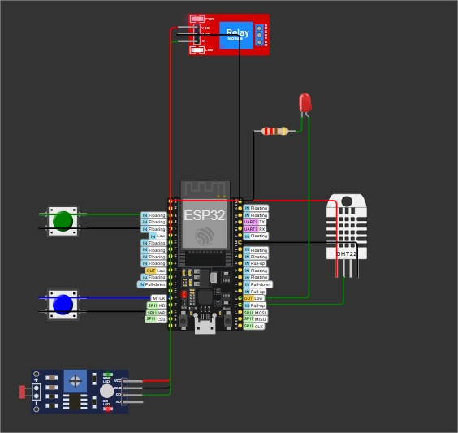

# FIAP - Faculdade de Informática e Administração Paulista

<p align="center">
<a href= "https://www.fiap.com.br/"></a>
</p>

<br>

# EasyAgro - FarmTechSolutions - Sistema de Sensores Agrícolas FarmTech Solutions

Este projeto implementa um sistema de monitoramento de solo e irrigação automatizada usando ESP32 no ambiente Wokwi, simulando sensores agrícolas para controle inteligente de irrigação.

## Nome do grupo

## 👨‍🎓 Integrantes: 
- <a href="https://www.linkedin.com/in/thiagoparaizo/?originalSubdomain=br">Thiago Paraizo</a>

## 👩‍🏫 Professores:
### Tutor(a) 
- <a href="https://www.linkedin.com/company/inova-fusca">Leonardo Ruiz Orabona</a>
### Coordenador(a)
- <a href="https://www.linkedin.com/company/inova-fusca">Andre Godoy Chiovato</a>

## 📋 Descrição do Projeto

O sistema monitora parâmetros essenciais do solo e controla automaticamente a irrigação baseado em condições pré-definidas, fornecendo dados em tempo real para otimização agrícola.

### Projeto no Wokwi
- [Acesse o Projeto Simulado no Wokwi](https://wokwi.com/projects/431524849386131457)



## 🔧 Componentes Utilizados

### Hardware Simulado (Wokwi)

- **ESP32 DevKit C** - Microcontrolador principal
- **DHT22** - Sensor de umidade (simulando sensor de umidade do solo)
- **2x Botões** - Simulando sensores de fósforo (P) e potássio (K)
- **Relé** - Controle da bomba de irrigação
- **LED** - Indicador visual do estado da bomba

### Pinos Utilizados

```cpp

cpp
#define PIN_FOSFORO_BTN 12// Botão simulando sensor de fósforo (P)
#define PIN_POTASSIO_BTN 14// Botão simulando sensor de potássio (K)
#define PIN_PH_LDR 35// LDR (reservado para futuras implementações)
#define PIN_UMIDADE_DHT 15// DHT22 simulando sensor de umidade do solo
#define PIN_RELE 27// Relé para controle da bomba de irrigação
#define PIN_LED_BOMBA 2// LED embutido indicador da bomba

```

## 🌱 Sensores Implementados

### 1. Sensor de Fósforo (P)

- **Simulação**: Botão físico (pino 12)
- **Função**: Detecta presença/ausência de fósforo no solo
- **Estados**: Presente (botão pressionado) / Ausente (botão solto)

### 2. Sensor de Potássio (K)

- **Simulação**: Botão físico (pino 14)
- **Função**: Detecta presença/ausência de potássio no solo
- **Estados**: Presente (botão pressionado) / Ausente (botão solto)

### 3. Sensor de pH

- **Simulação**: Função matemática senoidal
- **Função**: Monitora acidez/alcalinidade do solo
- **Faixa**: 0.0 - 14.0 (com variação contínua)
- **Ideal**: 6.0 - 7.5 para irrigação

### 4. Sensor de Umidade do Solo

- **Hardware**: DHT22 (reutilizado para simular umidade do solo)
- **Função**: Monitora umidade do substrato
- **Faixa**: 0% - 100%
- **Limites**: Mín. 30% / Máx. 70%

## 💧 Sistema de Irrigação Automatizada

### Lógica de Controle

A irrigação é ativada quando **TODAS** as condições são atendidas:

1. **Umidade do Solo** < 30% (solo seco)
2. **pH do Solo** entre 6.0 e 7.5 (condições ideais)

### Estados de Operação

- **ATIVADA**: Relé ligado, LED aceso, bomba funcionando
- **DESATIVADA**: Relé desligado, LED apagado, bomba parada

### Condições de Desativação

- Umidade > 70% (solo saturado)
- pH < 6.0 (muito ácido) ou pH > 7.5 (muito básico)

## 📊 Saída de Dados

### Formato CSV (Serial Monitor)

```

timestamp,fosforo,potassio,ph,umidade,irrigacao
12345,1,0,6.75,25.5,1

```

**Campos:**

- `timestamp`: Tempo em milissegundos desde inicialização
- `fosforo`: 1 (presente) / 0 (ausente)
- `potassio`: 1 (presente) / 0 (ausente)
- `ph`: Valor do pH (0.0-14.0)
- `umidade`: Percentual de umidade (0-100%)
- `irrigacao`: 1 (ativa) / 0 (inativa)

### Configuração Serial

- **Baud Rate**: 115200
- **Intervalo de Leitura**: 5 segundos
- **Formato**: CSV para fácil importação

## 🚀 Como Usar

### 1. Configuração no Wokwi

1. Copie o código para um novo projeto Wokwi
2. Configure os componentes conforme o diagrama de pinos
3. Execute a simulação

### 2. Teste dos Sensores

- **Fósforo/Potássio**: Pressione os botões para simular presença
- **pH**: Valores variam automaticamente (senoidal)
- **Umidade**: Use DHT22 ou valores simulados automáticos

### 3. Monitoramento

- Abra o Serial Monitor (115200 baud)
- Observe os dados CSV em tempo real
- Acompanhe o status da irrigação

## 📈 Parâmetros Configuráveis

```cpp

cpp
// Limites de Umidade
const float LIMITE_UMIDADE_MIN = 30.0;// Ativa irrigação
const float LIMITE_UMIDADE_MAX = 70.0;// Desativa irrigação// Limites de pH
const float LIMITE_PH_MIN = 6.0;// pH mínimo ideal
const float LIMITE_PH_MAX = 7.5;// pH máximo ideal// Simulação de pH
float ph_base = 7.0;// pH neutro base
float ph_amplitude = 3.5;// Amplitude de variação
float ph_frequencia = 0.001;// Velocidade de mudança

```

## 🔄 Funcionalidades Avançadas

### Simulação Inteligente de pH

- Variação senoidal contínua e suave
- Cobertura completa da faixa de pH (3.5 - 10.5)
- Permite teste de todas as condições de irrigação

### Detecção de Mudança de Estado

- Monitora transições nos botões de nutrientes
- Logs detalhados de alterações de estado
- Resposta em tempo real

### Teste Automático de Sistema

- Inicialização com teste de 3 segundos
- Verificação de conectividade de componentes
- Simulação alternada de umidade para testes

## 📋 Aplicações Práticas

### Agricultura de Precisão

- Monitoramento contínuo de parâmetros do solo
- Irrigação baseada em dados científicos
- Otimização do uso de recursos hídricos

### Pesquisa e Desenvolvimento

- Plataforma de testes para algoritmos de irrigação
- Coleta de dados para análise estatística
- Validação de modelos agronômicos

### Educação

- Demonstração de conceitos de IoT agrícola
- Ensino de automação e sensoriamento
- Integração entre hardware e software

## 🛠️ Expansões Possíveis

### Hardware

- Sensores reais de pH, NPK e umidade
- Comunicação WiFi/LoRa para telemetria
- Interface web para monitoramento remoto
- Válvulas solenoides para irrigação zoneada

### Software

- Algoritmos de machine learning
- Previsão de necessidades de irrigação
- Integração com APIs meteorológicas
- Dashboard em tempo real

## 📞 Suporte e Contribuição

Este código faz parte do sistema **FarmTech Solutions** e pode ser adaptado para diferentes necessidades agrícolas. Para dúvidas ou sugestões, consulte a documentação completa do projeto.

---

**Desenvolvido para:** Sistema de Monitoramento Agrícola Inteligente

**Plataforma:** ESP32 + Wokwi Simulator

## 🗃 Histórico de lançamentos

* 1.0.0 - 23/05/2025
    * 

## 📋 Licença

<p xmlns:cc="http://creativecommons.org/ns#" xmlns:dct="http://purl.org/dc/terms/"><a property="dct:title" rel="cc:attributionURL" href="https://github.com/agodoi/template">MODELO GIT FIAP</a> por <a rel="cc:attributionURL dct:creator" property="cc:attributionName" href="https://fiap.com.br">Fiap</a> está licenciado sobre <a href="http://creativecommons.org/licenses/by/4.0/?ref=chooser-v1" target="_blank" rel="license noopener noreferrer" style="display:inline-block;">Attribution 4.0 International</a>.</p>
